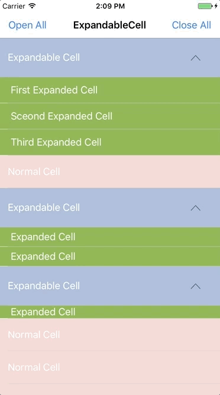

# ExpandableCell
[](https://github.com/sindresorhus/awesome)
[](http://cocoapods.org/pods/ExpandableCell)
[](https://github.com/Carthage/Carthage)
[](https://github.com/younatics/YNExpandableCell/blob/master/LICENSE)
[](http://cocoapods.org/pods/ExpandableCell)
[](https://developer.apple.com/swift/)

## Intoduction
Fully refactored [YNExapnadableCell](https://github.com/younatics/YNExpandableCell) with more concise, bug free. Easiest usage of expandable & collapsible cell for iOS, written in Swift 3. You can customize expandable `UITableViewCell` whatever you like. `ExpandableCell` is made because `insertRows` and `deleteRows` is hard to use. Just inheirt `ExpandableDelegate`



## Requirements

`ExpandableCell` written in Swift 3. Compatible with iOS 8.0+

## Installation

### Cocoapods

ExpandableCell is available through [CocoaPods](http://cocoapods.org). To install
it, simply add the following line to your Podfile:

```ruby
pod 'ExpandableCell'
```
### Carthage
```
github "younatics/ExpandableCell"
```
## Usage
```swift
import ExpandableCell
```

Make `ExpandableTableView` in Storyboard or in code
```swift
@IBOutlet var tableView: ExpandableTableView!
```

Inherit `ExpandableDelegate`
```swift
class ViewController: UIViewController, ExpandableDelegate 
```

Set delegate
```swift
tableView.expandableDelegate = self
```

Set required `ExpandableDelegate` method.

#### Key two methods
Set `expandedCells` and height in these two methods. Pass one parameter when you need to expand only one cell
```swift
func expandableTableView(_ expandableTableView: ExpandableTableView, expandedCellsForRowAt indexPath: IndexPath) -> [UITableViewCell]?
    
func expandableTableView(_ expandableTableView: ExpandableTableView, heightsForExpandedRowAt indexPath: IndexPath) -> [CGFloat]?
```

Set common `UITableViewDataSource`, `UITableViewDelegate` method
```swift
func expandableTableView(_ expandableTableView: ExpandableTableView, cellForRowAt indexPath: IndexPath) -> UITableViewCell
    
func expandableTableView(_ expandableTableView: ExpandableTableView, numberOfRowsInSection section: Int) -> Int
    
func expandableTableView(_ expandableTableView: ExpandableTableView, heightForRowAt indexPath: IndexPath) -> CGFloat    
```

Set optional `ExpandableDelegate` method.
```swift
func expandableTableView(_ expandableTableView: ExpandableTableView, didSelectRowAt indexPath: IndexPath)

func expandableTableView(_ expandableTableView: ExpandableTableView, expandedCell: UITableViewCell, didSelectExpandedRowAt indexPath: IndexPath)

func expandableTableView(_ expandableTableView: ExpandableTableView, didSelectExpandedRowAt indexPath: IndexPath)

func expandableTableView(_ expandableTableView: ExpandableTableView, titleForHeaderInSection section: Int) -> String?

func expandableTableView(_ expandableTableView: ExpandableTableView, heightForHeaderInSection section: Int) -> CGFloat

func expandableTableView(_ expandableTableView: ExpandableTableView, viewForHeaderInSection section: Int) -> UIView?
    
func numberOfSections(in expandableTableView: ExpandableTableView) -> Int

func expandableTableView(_ expandableTableView: ExpandableTableView, willDisplay cell: UITableViewCell, forRowAt indexPath: IndexPath)
    
func expandableTableView(_ expandableTableView: ExpandableTableView, willDisplayHeaderView view: UIView, forSection section: Int)
    
func expandableTableView(_ expandableTableView: ExpandableTableView, willDisplayFooterView view: UIView, forSection section: Int)
```

### Customize
Inherit `ExpandableCell` when you need arrow effect or change arrow image

```swift
open class ExpandableCell: UITableViewCell {
    open var arrowImageView: UIImageView!
}
```

Use close and open all function
```Swift
tableView.closeAll()
tableView.openAll()
```

Set tableview insert animation
```Swift
tableView.animation = .automatic
```

Make protocols in `ExpandableDelegate` if you need or make pull request to me :)

## References
#### Please tell me or make pull request if you use this library in your application :) 

## Author
[younatics 🇰🇷](http://younatics.github.io)

## License
ExpandableCell is available under the MIT license. See the LICENSE file for more info.
